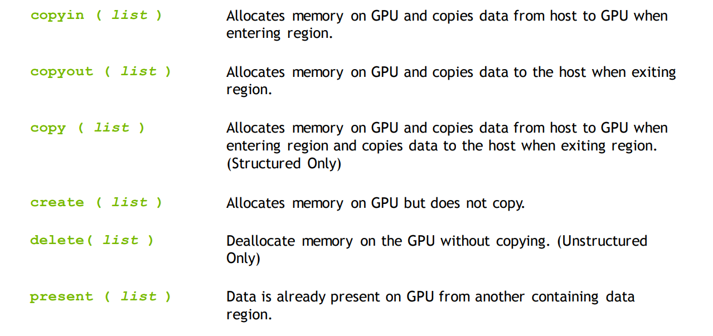

# OpenACC
语法

```c++
#pragma acc parallel
会产生一个或者多个gang并行执行代码
#pragma acc loop
提醒编译器下方代码需要并行的去执行

-ta=tesla:managed

kernels与parallel的区别，kernels需要编译器来保证并行的正确性
#pragma acc kernels
{
    for(int i=0; i<N; i++)
    {
        x[i] = 1.0;
        y[i] = 2.0;
    }
    for(int i=0; i<N; i++)
    {
        y[i] = a*x[i] + y[i];
    }
}
```


必须指定arrays的大小
```c++
#pragma acc data copyin(a[0:nelem]) copyout(b[s/4:3*s/4])

#pragma acc data
```
data指令定义了一个代码区域，其中GPU数组保留在GPU上，并在该区域的所有内核之间共享。

在我们在CPU上改变向量之后，我们需要在GPU上更新它。
```c++
#pragma acc update device(v.coefs[:v.n])
```
可以在loop后面增加gang，worker，vector，并指定他们的数量
```c++
num_gangs(n), num_workers(n), vector_length(n)
```
collapse可用于加速嵌套循环
```c++
#pragma acc parallel loop collapse(2)
```